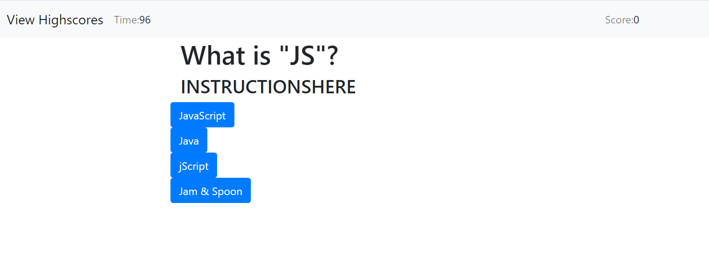
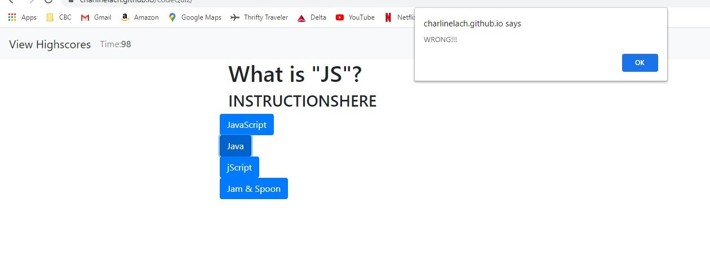

# Code Quiz
The purpose of this assignment is to allow users (JavaScript students) to take a small digital quiz to compare work to peers. There may be a lot of needed changes for them to work on...

**Created**: `2020 September 29`
 
Deployed at: https://charlinelach.github.io/codeQuiz/
 
Repository: https://github.com/charlinelach/codeQuiz

## Technologies
HTML, CSS, JavaScript

# Development:

## Usage Instructions
To utilize this website/application, end users may access it via [Deploy link](https://charlinelach.github.io/codeQuiz/). From this website, the user can perform clicks to take the quiz.

 

## Installation Instructions
N/A

## Credits & Thank Yous
Shout out to the wonderful instructor(s) and TAs! Another thank you to fellow students and asking questions before they form in my head.

# License Information
<<<<<<< HEAD
MIT License  
Copyright (c) 2020
=======
N/A
>>>>>>> 464da4e73f8413cc900f05016dce8f1a18d8a835
